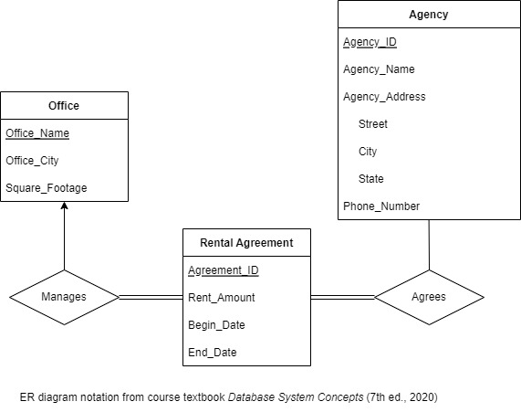
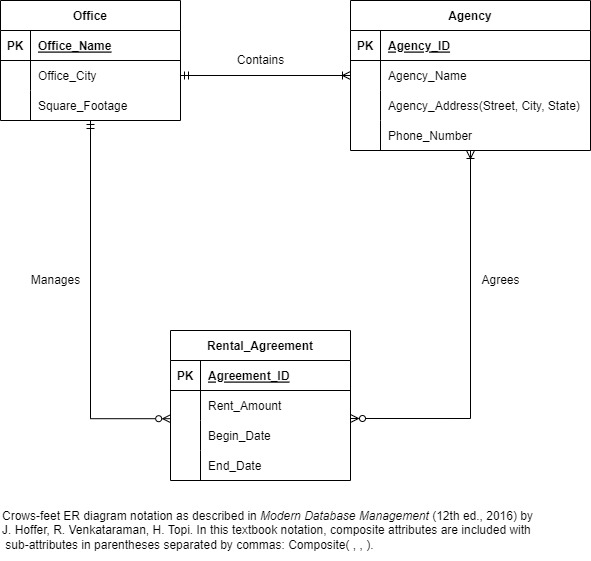
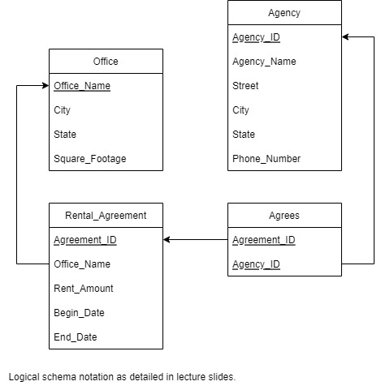

# 461GroupProject

### Note: Agency_Address is a composite attribute
## Relationship Explanations
### Contains
All agencies are contained in an office (1)  
All offices contain at least one agency (1 or more)
### Manages
Offices can manage multiple rental agreements (0 or more)  
Rental agreements are managed by exactly one office (1)
### Agrees
Agencies can agree on multiple rental agreements (0 or more)  
Rental agreements are agreed upon by one or more rental agencies (1 or more)  
  

