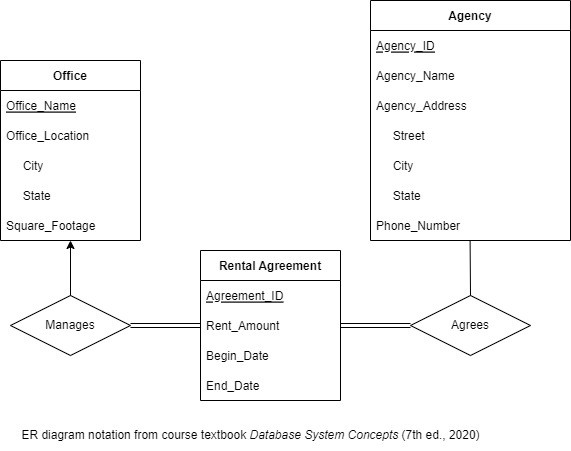

# 461GroupProject
  
Note: Agency_Address and Office_Location are composite attributes
## Relationship Explanations

### Manages
(One to Many)   
Offices can manage none or multiple rental agreements (0 or more, partial participation)  
Rental agreements are managed by exactly one office (exactly 1, total participation)
### Agrees
(Many to Many)  
Agencies can agree on none or multiple rental agreements (0 or more, partial participation)  
Rental agreements are agreed upon by one or more rental agencies (1 or more, total participation)  
  

